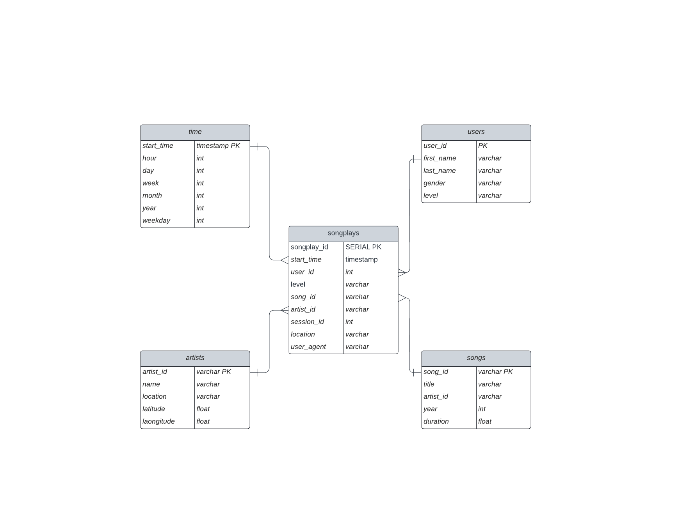

# Project: Data Modeling with Postgres
## Purpose/Objective
> The purpose of this code is to build an ETL pipeline using Python and SQL for the startup company Sparkify in order for them to analyze the data they have been collection on songs and user activity through their new music streaming app. The analytics team is looking to understand what songs users are listening to. This code will allow an easy way to query their data through a Postgres database schema with the ETL pipeline that transfers data from files in two local directories into the database tables.
---
## Database Schema
> The schema used in creating this database is the Star Schema. It has a single and central fact table called **songplays** which includes records in log data associated with song plays. This connects to multiple dimension tables(**users,songs,artists, and time**) through the use of the primary keys in each table. This schema allows for the creation of simple query's that do not require multiple joins that will allow the analysts to aggregate the data easily.

## ETL Pipeline
#### These are the files that are included in this project:
* `create_tables.py`: uses pythong to drop and create tables
* `etl.ipynb`: reads and processes a single file from song_data and log_data and loads the data into your tables  
* `etl.py`: reads and processes files from song_data and log_data and loads them into the tables
* `sql_queries.py`: this has queries used to drop, create and populate tables 
* `test.ipynb`: this has functions and queries used to test the pipeline
* `data/log_data`: this consists of log files in JSON format 
* `data/song_data`: this data is also in JSON format and contains metadata about a song and the artist of that song 
* `database_schema`: This is an image of the database star schema

#### Steps to run ETL Pipeline Process
1. Run `create_tables.py` to create the tables.
2. Run `etl.py` to extract data from song_data and log_data then insert that data into the correct tables in the database.
3. Run `test.ipynb` to confirm the records were properly inserted into each table in the database.